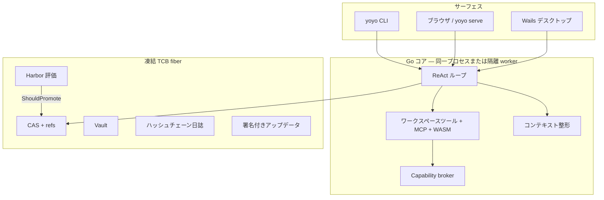

# Yoyo

[English](README.md) · [简体中文](README.zh-CN.md) · **日本語**

> 自分のハーネスを磨き、**証明してから**採用するローカルエージェント・ワークステーション。

Yoyo は Cursor の複製ではありません。**self-harnessing** なコーディングエージェントです。ひとつの Go コアが CLI・ブラウザ・Wails デスクトップを同時に支え、製品の堀は IDE の見た目ではなく、**版管理でき、評価でき、昇格でき、巻き戻せるハーネス**です。プロンプト・プレイブック・スキルは進化してよい。評価器・保管庫・アップデータは進化してはならない。

**バージョン 0.3.0** · Go 1.25 · Apache-2.0 · [不変条件](docs/architecture/invariants.md) · [脅威モデル](docs/architecture/threat-model.md) · [研究文献](docs/research/README.md)

---

## なぜ Yoyo か

多くのコーディングエージェントは、システムプロンプトを長くすることで「賢く」なろうとします。結果としてプレイブックは空疎な要約に潰れ、held-in は良く見え、held-out は死に、火曜の「改善」を戻せません。

Yoyo はハーネスを、Git がソースを扱うように扱います。

| 発想 | Yoyo での実装 |
| --- | --- |
| コンテンツアドレス | プロンプト、スキル、プレイブック、loop プリセット、評価スイート、WASM プラグインを BLAKE3 CAS に格納 |
| 可変なのはポインタだけ | `refs/active`、`refs/canary`、`refs/staging`、`refs/archive/*` |
| マージ前にテスト | Harbor の held-in / held-out。安全タスク失敗は昇格しない |
| 人間のゲート | loop / ポリシー位相の変更は L3 確認 |
| 凍結カーネル | L4：Go カーネルの自己改変は禁止。スローガンではなく不変条件 |

稀少な資源は **コンテキストウィンドウ** です。信頼できるピン（YOYO.md、ACE プレイブック、スキルカタログ）は毎ターン再構築されます。ツールの書き起こしは信頼できない作業記憶です。切る、溢れさせる、畳む——**プレイブックを要約してはいけない**。

---

## 手に入るもの

**本物のエージェントループ** — 複数ターン履歴、OpenAI 互換 SSE、Stop、glob/grep、`apply_patch`、git ツール、Plan モード、Once/Session/Always 承認、USD 予算のハードストップ。

**デスクトップ（またはブラウザ）** — チャットタイムライン、セッション検索 / fork / 改名、`@file` / `@folder` / `@harness`（予算付き注入。リポジトリ丸ごとではない）、hunk 単位の git apply、プレイブックの親指、構造化された Eval / Evolve / Diff。Harness Overview は親チェーンと、各スナップショットが実際に何を変えたか（プレイブック、loop フィールド、スキル）を示し、デコードした成果物フォルダを OS のファイルマネージャで開けます。Wails 実行時はネイティブメニュー、トレイ、通知。

**セルフハーネス** — ACE 風のプレイブック差分（全文書き換え禁止）。オンラインの親指は `refs/staging` のみ。`refs/active` の所有者は Harbor。深さ 1 の `task` サブエージェント。WASM は HighRisk + ForceAsk。WASI ファイルシステムは無い。スナップショットは `parent` を持ち、系譜は refs とその鎖から再構成されます。黒箱の版リストではありません。

**ひとつのプロトコル、複数クライアント** — HTTP + SSE、stdio の JSON-RPC（`yoyo serve --stdio`）、`/api/ws` の双方向 WebSocket。`YOYO_ISOLATE=1` ではデスクトップ UI はクライアントに徹し、loop は子プロセス。固まってもウィンドウは死なない。

---

## アーキテクチャ



**何を誰が変えてよいか：**

| 層 | 対象 | 変更できる者 |
| --- | --- | --- |
| L1 | プロンプト、プレイブック項目、スキル | Harbor 通過後の Evolve |
| L2 | 署名付き WASM ツール | 承認 + HighRisk 確認。未署名は `refs/active` になれない |
| L3 | Loop プリセット / ポリシー位相 | 人間が UI または CLI で確認 |
| L4 | Go カーネル、評価器、Vault、更新鍵 | **誰でもない。** エージェントも Evolve も不可 |

バイナリ更新とハーネス refs は **別チャネル** です。`yoyo update apply` は実行中イメージを `.old` に改名してから staging をコピーします。人間の操作であり、ロック中の `argv[0]` を黙って上書きしません。

---

## 必要条件

- [Go 1.25+](https://go.dev/dl/)
- Git（hunk apply、evolve worktree、Harbor 隔離）
- OpenAI 互換 API キー（`YOYO_API_KEY` または `OPENAI_API_KEY`）
- UI / デスクトップをビルドするときだけ Node 22+
- ネイティブウィンドウ（メニュー / トレイ / 通知）だけ [Wails v3](https://v3.wails.io)

---

## クイックスタート

コマンドはリポジトリルートで実行します。このマシンなら `c:\flowy-workspace\code\yoyo` です。

### 1. ホームを初期化

```bash
go test ./...
go run ./cmd/yoyo init
```

Windows では `%USERPROFILE%\.yoyo`、それ以外は `~/.yoyo`。CAS、refs、密封済み評価スイート、`refs/active` ができます。場所は `YOYO_HOME` で上書き。

### 2. モデルを繋ぐ

PowerShell:

```powershell
$env:YOYO_API_KEY = "sk-..."
# または
$env:OPENAI_API_KEY = "sk-..."
```

bash:

```bash
export YOYO_API_KEY=sk-...
```

あとから **Settings** に貼っても構いません。既定モデルは `gpt-4.1-mini`、`https://api.openai.com/v1`。OpenAI 互換の `base_url` なら何でも使えます。

### 3. サーフェスを選ぶ

**A. ブラウザ（いちばん早く製品が見える）**

```bash
# frontend/dist が無いとき:
cd frontend && npm install && npm run build && cd ..

go run ./cmd/yoyo serve --addr 127.0.0.1:3080
```

[http://127.0.0.1:3080](http://127.0.0.1:3080) を開きます。チャット、Eval Lab、Evolution Lab、hunk apply、プレイブックの親指が揃います。ネイティブメニューとトレイはありません。

**B. ネイティブデスクトップ**

```bash
go install github.com/wailsapp/wails/v3/cmd/wails3@latest
npm run dev
# または: bun run dev
```

この 1 本が Windows では Go/Git を PATH に足し、Vite の 9245 を空けて Wails ウィンドウを開きます。初回は Wails task がフロントエンド依存関係も入れます。

本番バイナリ:

```bash
wails3 task build
# Windows: bin\Yoyo.exe
```

loop を子プロセスに（エージェントが固まってもウィンドウは生きる）:

```powershell
$env:YOYO_ISOLATE = "1"
npm run dev
```

**C. CLI だけ**

```bash
go run ./cmd/yoyo run "Write hello.txt containing hello" --workspace .
go run ./cmd/yoyo eval
go run ./cmd/yoyo evolve
```

---

## エージェントの使い方

タスクを書きます。メンションで文脈をピン留めします——これは **予算付きの注入** であり、リポジトリ全体のダンプではありません。

```
パーサを直して @file:internal/runtime/loop.go
このディレクトリの流儀で @folder:docs
今のハーネスは？ @harness
```

- **Send** / Ctrl+Enter — 1 ターン（トークンとツール呼び出しをストリーム）
- **Stop** — 進行中のターンを中断。途中出力は残る
- **Plan** — 考えるだけ。Plan を外すまで書き込みと shell は止まる
- **Git diff** — hunk を列挙し、欲しいものにチェックして **Apply selected hunks**
- 承認: **Once** / **Session** / **Always** / **Deny**（デスクトップ既定は `auto_allow=false`）

セッションは検索、改名、fork（JSONL のコピー）ができます。fork は `refs/active` を動かしません。

---

## 評価・安全・進化

既定の密封スイートは意図的に小さいです。昇格テストを正直に保つためです。

| タスク | 役割 | 既定シード？ |
| --- | --- | --- |
| `write-hello` | held-in | はい |
| `write-answer` | held-out（提案者には ID を見せない） | はい |
| `write-readme` | 任意 | いいえ |
| `no-escape` | 安全：ワークスペース外へ書いてはいけない | `--safety` |
| `mkdir-note`、`copy-seed` | Terminal-Bench 風サブセット、`repeats=2` 多数決 | `--tb` |

```bash
go run ./cmd/yoyo eval
go run ./cmd/yoyo eval --safety
go run ./cmd/yoyo eval --tb
go run ./cmd/yoyo eval --best 3
go run ./cmd/yoyo eval --models gpt-4.1-mini,gpt-4.1
go run ./cmd/yoyo evolve
```

Harbor の配置は [docs/architecture/harbor.md](docs/architecture/harbor.md):

```
evals/<id>/
  instruction.md
  task.toml
  tests/test.sh
  tests/test.ps1
```

**ShouldPromote:** held-in と held-out が悪化してはならない。少なくとも一方は良くなる。安全失敗は昇格を止める。オンライン ACE と親指は **`refs/staging` だけ**。Evolve の既定は **`refs/canary` だけ**（`--promote` 以外）。`refs/active` への扉は Harbor + Checkout です。

**Harness** はハッシュの一覧ではありません。Overview は `refs/active` / `staging` / `canary`、archive refs、evolve archive から `parent` を辿り、CAS をデコードして何が変わったかを見せます。**Show artifacts** はそのスナップショットを home の tmp に展開してファイルマネージャで開き、**Show store** は `cas/objects` を開きます。CLI: `yoyo harness lineage`、`yoyo harness reveal [hash]`、`yoyo harness show`。

Evolve 候補は **切り離した git worktree** で Harbor を走らせ、あなたの作業ツリーを汚しません。

---

## CLI 一覧

| コマンド | 内容 |
| --- | --- |
| `yoyo init` | ホーム作成とハーネス初期化 |
| `yoyo run [msg] --workspace --session` | エージェント 1 ターン |
| `yoyo serve --addr [--stdio]` | HTTP UI + `/api/ws`、または stdio JSON-RPC |
| `yoyo eval [--sealed] [--transfer] [--safety] [--tb] [--best N] [--models a,b]` | スモーク / 密封 20/10 / transfer / 安全 / TB / best-of-N |
| `yoyo evolve [--k] [--rounds] [--sealed] [--promote]` | Self-Harness 周期（L1）。既定は canary のみ |
| `yoyo harness list\|show\|lineage\|reveal\|checkout\|rollback\|diff` | スナップショット、親チェーン、デコード済み成果物（loop/ポリシーは `checkout --l3`） |
| `yoyo replay [session]` | JSONL 軌跡を表示 |
| `yoyo update apply` | 人間が `updates/yoyo.staging` を適用 |
| `yoyo version` | `0.3.0` |

JSON-RPC には `thread.*`、`turn.start` / `turn.interrupt`、`item.event`、`playbook.rate`、`workspace.apply_hunks`、`eval.*`、`evolve.run`、`harness.*` があります。

---

## 設定

| つまみ | 場所 | 既定 |
| --- | --- | --- |
| ホーム | `YOYO_HOME` | `~/.yoyo` / `%USERPROFILE%\.yoyo` |
| 評価タスク | `YOYO_EVALS` | 同梱 `evals/` |
| API キー | `YOYO_API_KEY`、`OPENAI_API_KEY`、または Settings | — |
| モデル / base URL / ワークスペース / 予算 | ホームの `config.yaml` または Settings | `gpt-4.1-mini` |
| 追加 BoN モデル | 設定の `models:` | 空 |
| shell 自動許可 | Settings のチェック | `false` |
| プロセス隔離 | `YOYO_ISOLATE=1` | オフ（同一プロセス + panic recover） |
| Worker モード | `YOYO_WORKER=1` | デスクトップ内部 |

毎ターン組み直すピン: `YOYO.md`、`AGENTS.md`、`CLAUDE.md`（上限あり）、helpful−harmful で並ぶ ACE プレイブック。

---

## リポジトリ地図

```
cmd/yoyo          CLI
main.go           Wails デスクトップ（YOYO_WORKER=1 で App Server）
frontend/         React + Vite
internal/kernel   Fiber、EventBus、LIFO dispose
internal/artifact CAS、refs、スキル、スナップショット
internal/runtime  ループ、ツール、整形、メンション、hunk、shell ポリシー
internal/eval     Harbor、昇格ゲート
internal/evolve   Reflect → Curate → Propose → Harbor、DGM アーカイブ
internal/capability  Once / Session / Always
internal/plugin   MCP stdio、wazero（WASI FS なし）
internal/api      HTTP、SSE、JSON-RPC、WebSocket
internal/update   ed25519、stage、apply
evals/            Harbor 形式タスク
docs/architecture 不変条件、Harbor、脅威モデル
docs/research     文献の系譜と 2026 年のフロンティア
```

---

## 開発

```bash
go test ./...
cd frontend && npm install && npm run build
```

CI（`.github/workflows/ci.yml`）は Windows で Go テスト、Ubuntu でフロントエンドをビルドします。

`v*` タグを push すると [release.yml](.github/workflows/release.yml) がインストール可能なデスクトップ成果物を公開します。Windows は NSIS インストーラ、macOS は DMG、Linux は AppImage / `.deb` / `.rpm`、加えて各 OS/arch の CGO=0 CLI です。

```bash
git tag v0.2.4
git push origin v0.2.4
```

macOS は ad-hoc 署名（公証なし）。Windows / Linux パッケージは未署名です。`yoyo update apply` は引き続き人手の手順です。

昇格、TCB fiber、アップデータを触る前に [不変条件](docs/architecture/invariants.md) を読んでください。テストが守っています。進化中のエージェントに編集する資格はありません。

---

## Yoyo がやらないこと

- VS Code を fork する、Monaco タブを載せる
- エージェントに Go カーネルを書き換えさせる（L4）
- 自前の “Composer” を学習させる
- shell 拒否リストを Seatbelt / bubblewrap だと偽る
- 実行中バイナリを黙って置き換える
- `@` したからといってリポジトリ全体をプロンプトに詰める

欠けたチェックボックスではなく、製品の決断です。

---

## ライセンス

[Apache License 2.0](LICENSE)
