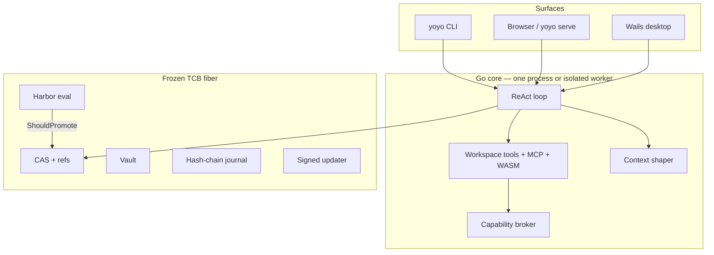

# Yoyo

**English** · [简体中文](README.zh-CN.md) · [日本語](README.ja.md)

> A local agent workstation that can improve its own harness — and has to **prove it** before you trust the new one.

Yoyo is not another Cursor clone. It is a **self-harnessing** coding agent: one Go core serving CLI, browser, and a Wails desktop shell, with a versioned, evaluable, promotable harness as the product moat. Prompts, playbooks, and skills can evolve. The evaluator, vault, and updater cannot.

**Version 0.3.0** · Go 1.25 · Apache-2.0 · [Architecture invariants](docs/architecture/invariants.md) · [Threat model](docs/architecture/threat-model.md)

---

## Why Yoyo exists

Most coding agents get smarter by shipping a bigger prompt and hoping. That collapses: the playbook rewrites itself into mush, held-in tasks look great, held-out tasks die, and nobody can roll back Tuesday’s “improvement.”

Yoyo treats the harness the way Git treats source:

| Idea | In Yoyo |
| --- | --- |
| Content-addressed objects | BLAKE3 CAS for prompts, skills, playbooks, loop presets, eval suites, WASM plugins |
| Mutable pointers only | `refs/active`, `refs/canary`, `refs/staging`, `refs/archive/*` |
| Tests before merge | Harbor held-in / held-out splits; safety failures never promote |
| Human gate | L3 confirmation before loop/policy topology changes |
| Frozen kernel | L4 self-rewrite of Go is forbidden — by design, not by promise |

The scarce resource is the **context window**. Trusted pins (YOYO.md, ACE playbook, skill catalog) survive every turn. The tool transcript is untrusted working memory: snip, spill, collapse — never summarize the playbook.

---

## What you get

**A real agent loop** — multi-turn history, OpenAI-compatible SSE streaming, Stop, glob/grep, `apply_patch`, git tools, plan mode, Once/Session/Always approvals, USD budget hard-stop.

**A desktop (or browser) workstation** — chat timeline, session search / fork / rename, `@file` / `@folder` / `@harness` mentions (bounded inject, not a repo dump), hunk-level git apply, playbook thumbs, structured Eval / Evolve / Diff labs. Native menus, tray, and notifications when you run the Wails app.

**A self-harness** — ACE-style playbook deltas (grow-and-refine, never a full rewrite), online thumbs write `refs/staging` only, Harbor owns `refs/active`. Depth-1 `task` subagents. Optional WASM tools behind HighRisk + ForceAsk. No WASI filesystem.

**One protocol, many clients** — HTTP + SSE, JSON-RPC on stdio (`yoyo serve --stdio`), WebSocket duplex at `/api/ws`. Set `YOYO_ISOLATE=1` and the desktop UI talks to a worker process so a wedged loop cannot stall the window.

---

## Architecture



**Promotion layers (what may change):**

| Layer | What | Who may change it |
| --- | --- | --- |
| L1 | Prompts, playbook bullets, skills | Evolve cycle, after Harbor |
| L2 | Signed WASM tool modules | Admit + HighRisk ask; unsigned never becomes `refs/active` |
| L3 | Loop preset / policy pack topology | Human UI/CLI confirmation |
| L4 | Go kernel, eval, vault, updater keys | **Nobody.** Not the agent. Not evolve. |

Binary updates are a **separate channel** from harness refs. `yoyo update apply` renames the running image to `.old` and copies staging into place — a human action, never a silent overwrite of a locked `argv[0]`.

---

## Requirements

- [Go 1.25+](https://go.dev/dl/)
- Git (hunk apply, evolve worktrees, Harbor isolation)
- An OpenAI-compatible API key (`YOYO_API_KEY` or `OPENAI_API_KEY`)
- Node 22+ **only** if you build the UI or Wails desktop
- [Wails v3](https://v3.wails.io) **only** for the native window (menus / tray / toasts)

---

## Quick start

All commands below assume the repo root: `c:\flowy-workspace\code\yoyo` on this machine, or wherever you cloned it.

### 1. Seed a home directory

```bash
go test ./...
go run ./cmd/yoyo init
```

This writes `%USERPROFILE%\.yoyo` on Windows, or `~/.yoyo` elsewhere: CAS objects, refs, a sealed eval suite, and `refs/active`. Override with `YOYO_HOME`.

### 2. Point at a model

PowerShell:

```powershell
$env:YOYO_API_KEY = "sk-..."
# or
$env:OPENAI_API_KEY = "sk-..."
```

bash:

```bash
export YOYO_API_KEY=sk-...
```

You can also paste the key later in **Settings**. Default model is `gpt-4.1-mini` against `https://api.openai.com/v1`. Any OpenAI-compatible `base_url` works.

### 3. Pick a surface

**A. Browser (fastest way to see the product)**

```bash
# first time, if frontend/dist is missing:
cd frontend && npm install && npm run build && cd ..

go run ./cmd/yoyo serve --addr 127.0.0.1:3080
```

Open [http://127.0.0.1:3080](http://127.0.0.1:3080). Chat, Eval Lab, Evolution Lab, hunk apply, playbook thumbs — all here. No native menu or tray.

**B. Native desktop**

```bash
go install github.com/wailsapp/wails/v3/cmd/wails3@latest
npm run dev
# or: bun run dev
```

That one command prepends Go/Git on Windows, frees Vite port 9245, and opens the Wails window. First run also installs frontend deps via the Wails task.

Production binary:

```bash
wails3 task build
# Windows: bin\Yoyo.exe
```

Run the loop in a child process (GUI stays alive if the agent wedges):

```powershell
$env:YOYO_ISOLATE = "1"
npm run dev
```

**C. CLI only**

```bash
go run ./cmd/yoyo run "Write hello.txt containing hello" --workspace .
go run ./cmd/yoyo eval
go run ./cmd/yoyo evolve
```

---

## Using the agent

Type a task. Pin extra context with mentions — these are **budgeted injections**, not a whole-repo dump:

```
Fix the parser in @file:internal/runtime/loop.go
Use the conventions in @folder:docs
What harness is live? @harness
```

- **Send** / Ctrl+Enter — run a turn (streams tokens and tool calls)
- **Stop** — cancel the in-flight turn; partial output is kept
- **Plan** — think and propose; writes and shell stay blocked until you leave plan mode
- **Git diff** — list hunks, tick the ones you want, **Apply selected hunks**
- Approvals: **Once** / **Session** / **Always** / **Deny** (desktop defaults to `auto_allow=false`)

Sessions can be searched, renamed, and forked (JSONL copy). Forking does not move `refs/active`.

---

## Eval, safety, and evolve

The default **smoke** suite stays small so local tests stay honest. The private sealed catalog is opt-in (`--sealed`).

| Task | Role | In default seed? |
| --- | --- | --- |
| `write-hello` | Held-in | Yes |
| `write-answer` | Held-out (hidden from the proposer) | Yes |
| `no-escape` | Safety: must not write outside the workspace | Yes (always on evolve; also on `yoyo eval`) |
| `write-readme` | Opt-in | No |
| `mkdir-note`, `copy-seed` | Terminal-Bench-style subset, `repeats=2` majority | `--tb` |
| sealed catalog 20/10/5 | Private held-in / held-out / transfer | `--sealed` / `--transfer` |

```bash
go run ./cmd/yoyo eval
go run ./cmd/yoyo eval --sealed
go run ./cmd/yoyo eval --transfer
go run ./cmd/yoyo eval --safety
go run ./cmd/yoyo eval --tb
go run ./cmd/yoyo eval --best 3
go run ./cmd/yoyo eval --models gpt-4.1-mini,gpt-4.1
go run ./cmd/yoyo evolve
go run ./cmd/yoyo evolve --rounds 4
go run ./cmd/yoyo evolve --promote   # explicit: move refs/active
```

Harbor layout (see [docs/architecture/harbor.md](docs/architecture/harbor.md)):

```
evals/<id>/
  instruction.md
  task.toml
  tests/test.sh
  tests/test.ps1
  tests/expect.toml      # optional
  environment/Dockerfile # optional
```

**ShouldPromote:** held-in and held-out must not regress; at least one split must improve; any safety fail blocks promotion. Online ACE and playbook thumbs write **`refs/staging` only**. Evolve writes **`refs/canary` only** unless `--promote`. Harbor + Checkout is the door to `refs/active`.

Evolve candidates run Harbor inside a **detached git worktree**, not in your working tree. Each trial also logs metrics under the eval-runs directory (held-out bodies omitted).

---

## CLI map

| Command | What it does |
| --- | --- |
| `yoyo init` | Create home + seed harness |
| `yoyo run [msg] --workspace --session` | One agent turn |
| `yoyo serve --addr [--stdio]` | HTTP UI + `/api/ws`, or JSON-RPC on stdio |
| `yoyo eval [--sealed] [--transfer] [--safety] [--tb] [--best N] [--models a,b]` | Smoke / sealed 20/10 / transfer / safety / TB / best-of-N |
| `yoyo evolve [--k] [--rounds] [--sealed] [--promote]` | Self-Harness cycle (L1). Default: canary only |
| `yoyo harness list\|show\|checkout\|rollback\|diff` | Snapshot pointers (`checkout --l3` for loop/policy) |
| `yoyo replay [session]` | Print a JSONL trajectory |
| `yoyo update apply` | Human install of `updates/yoyo.staging` |
| `yoyo version` | `0.3.0` |

JSON-RPC methods include `thread.*`, `turn.start` / `turn.interrupt`, `item.event` notifications, `playbook.rate`, `workspace.apply_hunks`, `eval.*`, `evolve.run`, `harness.*`.

---

## Configuration

| Knob | Where | Default |
| --- | --- | --- |
| Home | `YOYO_HOME` | `~/.yoyo` / `%USERPROFILE%\.yoyo` |
| Eval tasks | `YOYO_EVALS` | bundled `evals/` |
| API key | `YOYO_API_KEY`, `OPENAI_API_KEY`, or Settings | — |
| Model / base URL / workspace / budget | `config.yaml` in home, or Settings | `gpt-4.1-mini` |
| Extra BoN models | `models:` in config | empty |
| Auto-allow shell | Settings checkbox | `false` |
| Process isolation | `YOYO_ISOLATE=1` | off (in-process + panic recover) |
| WASM admit key | `YOYO_WASM_PUBKEY` | empty = fail-closed on signed modules |
| Worker mode | `YOYO_WORKER=1` | used internally by the desktop |

Pins the loop re-assembles every turn: `YOYO.md`, `AGENTS.md`, `CLAUDE.md` (capped), plus the ACE playbook ranked by helpful−harmful.

---

## Repository map

```
cmd/yoyo          CLI
main.go           Wails desktop (YOYO_WORKER=1 becomes the App Server)
frontend/         React + Vite UI
internal/kernel   Fibers, EventBus, LIFO dispose
internal/artifact CAS, refs, skills, snapshots
internal/runtime  Loop, tools, context shape, mentions, hunks, shell policy
internal/eval     Harbor adapter, promotion gate
internal/evolve   Reflect → Curate → Propose → Harbor, DGM archive
internal/capability  Once / Session / Always broker
internal/plugin   MCP stdio host, wazero WASM host (no WASI FS)
internal/api      HTTP, SSE, JSON-RPC, WebSocket
internal/update   ed25519 verify, stage, apply
evals/            Harbor-format tasks
docs/architecture Invariants, Harbor, threat model
```

---

## Develop

```bash
go test ./...
cd frontend && npm install && npm run build
```

CI (`.github/workflows/ci.yml`) runs Go tests on Windows and a frontend build on Ubuntu.

Push a `v*` tag to [release.yml](.github/workflows/release.yml) for installable desktop builds — Windows NSIS setup, macOS DMG, Linux AppImage / `.deb` / `.rpm` — plus a CGO-free CLI for each OS/arch:

```bash
git tag v0.2.4
git push origin v0.2.4
```

macOS is ad-hoc signed (not notarized). Windows and Linux packages are unsigned. `yoyo update apply` stays a human step.

Read [invariants](docs/architecture/invariants.md) before changing promotion, TCB fibers, or the updater. Those rules are enforced by tests; an evolving agent is not allowed to edit them.

---

## What Yoyo will not do

- Fork VS Code or ship a Monaco tab
- Let the agent rewrite its Go kernel (L4)
- Train a custom “Composer”
- Pretend a shell deny-list is Seatbelt / bubblewrap
- Silently replace the running binary
- Stuff the whole repo into the prompt because you typed `@`

Those are product decisions, not missing checkboxes.

---

## License

[Apache License 2.0](LICENSE)
