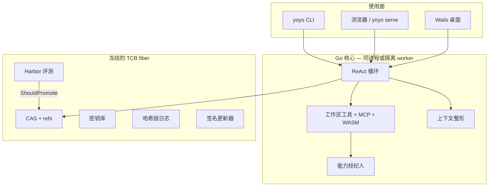

# Yoyo

[English](README.md) · **简体中文** · [日本語](README.ja.md)

> 一台能自我打磨的本地智能体工作站：先评测，再晋升。新 harness 没通过 Harbor，就不会成为你信任的那一份。

Yoyo 不是 Cursor 的仿制品。它是一台 **self-harnessing** 的编程智能体：同一套 Go 核心同时服务 CLI、浏览器和 Wails 桌面壳。产品护城河不是 IDE 皮肤，而是 **可版本化、可评测、可晋升、可回滚的 harness**。提示词、playbook、技能可以进化；评测器、密钥库、更新器不行。

**版本 0.1.0** · Go 1.25 · Apache-2.0 · [架构不变量](docs/architecture/invariants.md) · [威胁模型](docs/architecture/threat-model.md)

---

## 它为什么存在

多数编程智能体靠把 system prompt 写得更长来“变聪明”。结果是 playbook 被整段改写成空话、训练集任务看起来很好、留出任务崩掉，而且没法把周二那次“优化”撤回去。

Yoyo 对待 harness，就像 Git 对待源码：

| 想法 | 在 Yoyo 里 |
| --- | --- |
| 内容寻址 | BLAKE3 CAS 存放 prompt、技能、playbook、loop 预设、评测套件、WASM 插件 |
| 只有指针可变 | `refs/active`、`refs/canary`、`refs/staging`、`refs/archive/*` |
| 合并前先测 | Harbor 持有 / 留出划分；安全任务失败永远不能晋升 |
| 人闸 | 改 loop / 策略拓扑必须 L3 确认 |
| 冻结内核 | L4 禁止智能体改写 Go 内核——这是不变量，不是口号 |

真正稀缺的是 **上下文窗口**。受信任的钉子（YOYO.md、ACE playbook、技能目录）每轮都会重建。工具抄本是不可信的工作记忆：裁剪、外溢、折叠——**绝不把 playbook 摘要掉**。

---

## 你实际能用到什么

**一条真正的 agent 循环** — 多轮历史、OpenAI 兼容 SSE 流式、Stop、glob/grep、`apply_patch`、git 工具、Plan 模式、Once/Session/Always 审批、美元预算硬停止。

**桌面或浏览器工作站** — 对话时间线、会话搜索 / 分叉 / 重命名、`@file` / `@folder` / `@harness`（有预算的注入，不是整仓倾倒）、按 hunk 接受 git diff、playbook 点赞、结构化的 Eval / Evolve / Diff。用 Wails 跑时还有原生菜单、托盘和通知。

**自我打磨** — ACE 风格的 playbook 增量（只长不整篇重写），在线点赞只写 `refs/staging`，Harbor 才拥有 `refs/active`。深度为 1 的 `task` 子智能体。WASM 工具走 HighRisk + ForceAsk。没有 WASI 文件系统。

**一套协议，多种客户端** — HTTP + SSE、stdio 上的 JSON-RPC（`yoyo serve --stdio`）、`/api/ws` 双向 WebSocket。设置 `YOYO_ISOLATE=1` 时，桌面 UI 只当客户端，loop 跑在子进程，卡住也不会拖死窗口。

---

## 架构



**可以改什么、谁可以改：**

| 层级 | 内容 | 谁能改 |
| --- | --- | --- |
| L1 | 提示词、playbook 条目、技能 | Evolve 周期，且必须过 Harbor |
| L2 | 签名的 WASM 工具模块 | 准入 + HighRisk 询问；未签名的进不了 `refs/active` |
| L3 | Loop 预设 / 策略包拓扑 | 人在 UI 或 CLI 上确认 |
| L4 | Go 内核、评测器、密钥库、更新密钥 | **谁都不行。** 智能体不行，evolve 也不行。 |

二进制更新和 harness refs 是 **两条通道**。`yoyo update apply` 会把当前镜像改名为 `.old` 再拷入 staging——这是人的动作，不会在文件锁着的时候偷偷覆盖 `argv[0]`。

---

## 环境要求

- [Go 1.25+](https://go.dev/dl/)
- Git（hunk apply、evolve worktree、Harbor 隔离）
- OpenAI 兼容的 API Key（`YOYO_API_KEY` 或 `OPENAI_API_KEY`）
- 只有构建 UI / 桌面时才需要 Node 22+
- 只有原生窗口（菜单 / 托盘 / 通知）才需要 [Wails v3](https://v3.wails.io)

---

## 快速开始

下面命令都在仓库根目录执行。本机路径一般是 `c:\flowy-workspace\code\yoyo`。

### 1. 种下 home 目录

```bash
go test ./...
go run ./cmd/yoyo init
```

Windows 写到 `%USERPROFILE%\.yoyo`，其他系统是 `~/.yoyo`：CAS、refs、一份密封评测套件，以及 `refs/active`。用 `YOYO_HOME` 可改位置。

### 2. 接上模型

PowerShell：

```powershell
$env:YOYO_API_KEY = "sk-..."
# 或者
$env:OPENAI_API_KEY = "sk-..."
```

bash：

```bash
export YOYO_API_KEY=sk-...
```

也可以稍后在 **Settings** 里粘贴。默认模型是 `gpt-4.1-mini`，地址 `https://api.openai.com/v1`。任何 OpenAI 兼容的 `base_url` 都可以。

### 3. 选一个使用面

**A. 浏览器（最快看到产品）**

```bash
# 若还没有 frontend/dist：
cd frontend && npm install && npm run build && cd ..

go run ./cmd/yoyo serve --addr 127.0.0.1:3080
```

打开 [http://127.0.0.1:3080](http://127.0.0.1:3080)。聊天、Eval Lab、Evolution Lab、hunk apply、playbook 点赞都在这里。没有原生菜单和托盘。

**B. 原生桌面**

```bash
go install github.com/wailsapp/wails/v3/cmd/wails3@latest
npm run dev
# 或者：bun run dev
```

这一条会在 Windows 上补上 Go/Git 的 PATH、释放 Vite 的 9245 端口，并打开 Wails 窗口。第一次还会由 Wails task 安装前端依赖。

正式包：

```bash
wails3 task build
# Windows: bin\Yoyo.exe
```

让 loop 跑在子进程（智能体卡住时窗口还活着）：

```powershell
$env:YOYO_ISOLATE = "1"
npm run dev
```

**C. 只用 CLI**

```bash
go run ./cmd/yoyo run "Write hello.txt containing hello" --workspace .
go run ./cmd/yoyo eval
go run ./cmd/yoyo evolve
```

---

## 怎么用智能体

输入任务。用 mention 钉住额外上下文——这是 **有预算的注入**，不是把整个仓库塞进窗口：

```
修一下解析器 @file:internal/runtime/loop.go
按这个目录的约定 @folder:docs
当前 harness 是什么？ @harness
```

- **Send** / Ctrl+Enter — 跑一轮（流式输出 token 和工具调用）
- **Stop** — 取消进行中的一轮；已写出的内容会留下
- **Plan** — 只思考和提议；写文件和 shell 在退出 Plan 前被挡住
- **Git diff** — 列出 hunk，勾选后再 **Apply selected hunks**
- 审批：**Once** / **Session** / **Always** / **Deny**（桌面默认 `auto_allow=false`）

会话可以搜索、重命名、分叉（复制 JSONL）。分叉不会移动 `refs/active`。

---

## 评测、安全与进化

默认密封套件刻意很小，这样晋升测试才诚实：

| 任务 | 角色 | 默认种子里？ |
| --- | --- | --- |
| `write-hello` | 持有（held-in） | 是 |
| `write-answer` | 留出（held-out，提议者看不到身份） | 是 |
| `write-readme` | 可选 | 否 |
| `no-escape` | 安全：不得写到工作区外 | `--safety` |
| `mkdir-note`、`copy-seed` | Terminal-Bench 风格子集，`repeats=2` 多数票 | `--tb` |

```bash
go run ./cmd/yoyo eval
go run ./cmd/yoyo eval --safety
go run ./cmd/yoyo eval --tb
go run ./cmd/yoyo eval --best 3
go run ./cmd/yoyo eval --models gpt-4.1-mini,gpt-4.1
go run ./cmd/yoyo evolve
```

Harbor 布局见 [docs/architecture/harbor.md](docs/architecture/harbor.md)：

```
evals/<id>/
  instruction.md
  task.toml
  tests/test.sh
  tests/test.ps1
```

**ShouldPromote：** 持有和留出都不能回退；至少一边要变好；任何安全失败都会挡住晋升。在线 ACE 和 playbook 点赞 **只写 `refs/staging`**。通向 `refs/active` 的门只有 Harbor。

Evolve 候选在 **分离的 git worktree** 里跑 Harbor，不会弄脏你的工作树。

---

## CLI 一览

| 命令 | 作用 |
| --- | --- |
| `yoyo init` | 创建 home 并种下 harness |
| `yoyo run [msg] --workspace --session` | 一轮智能体 |
| `yoyo serve --addr [--stdio]` | HTTP UI + `/api/ws`，或 stdio JSON-RPC |
| `yoyo eval [--safety] [--tb] [--best N] [--models a,b]` | 密封套件 / 安全 / TB 子集 / best-of-N |
| `yoyo evolve` | 一次 Self-Harness 周期（L1 材料） |
| `yoyo harness list\|show\|checkout\|rollback\|diff` | 快照指针（改 loop/策略要 `checkout --l3`） |
| `yoyo replay [session]` | 打印 JSONL 轨迹 |
| `yoyo update apply` | 由人安装 `updates/yoyo.staging` |
| `yoyo version` | `0.1.0` |

JSON-RPC 包括 `thread.*`、`turn.start` / `turn.interrupt`、`item.event` 通知、`playbook.rate`、`workspace.apply_hunks`、`eval.*`、`evolve.run`、`harness.*`。

---

## 配置

| 旋钮 | 位置 | 默认 |
| --- | --- | --- |
| Home | `YOYO_HOME` | `~/.yoyo` / `%USERPROFILE%\.yoyo` |
| 评测任务 | `YOYO_EVALS` | 自带的 `evals/` |
| API Key | `YOYO_API_KEY`、`OPENAI_API_KEY`，或 Settings | — |
| 模型 / base URL / 工作区 / 预算 | home 里的 `config.yaml`，或 Settings | `gpt-4.1-mini` |
| 额外 BoN 模型 | 配置里的 `models:` | 空 |
| 自动放行 shell | Settings 勾选 | `false` |
| 进程隔离 | `YOYO_ISOLATE=1` | 关（同进程 + panic recover） |
| Worker 模式 | `YOYO_WORKER=1` | 桌面内部使用 |

每轮重建的钉子：`YOYO.md`、`AGENTS.md`、`CLAUDE.md`（有上限），以及按 helpful−harmful 排序的 ACE playbook。

---

## 仓库地图

```
cmd/yoyo          CLI
main.go           Wails 桌面（YOYO_WORKER=1 时变成 App Server）
frontend/         React + Vite 界面
internal/kernel   Fiber、EventBus、LIFO 卸载
internal/artifact CAS、refs、技能、快照
internal/runtime  循环、工具、上下文整形、mention、hunk、shell 策略
internal/eval     Harbor 适配、晋升门
internal/evolve   Reflect → Curate → Propose → Harbor，DGM 档案
internal/capability  Once / Session / Always 经纪人
internal/plugin   MCP stdio、wazero WASM（无 WASI FS）
internal/api      HTTP、SSE、JSON-RPC、WebSocket
internal/update   ed25519 校验、stage、apply
evals/            Harbor 格式任务
docs/architecture 不变量、Harbor、威胁模型
```

---

## 开发

```bash
go test ./...
cd frontend && npm install && npm run build
```

CI（`.github/workflows/ci.yml`）在 Windows 上跑 Go 测试，在 Ubuntu 上构建前端。

推送 `v*` 标签会触发 [release.yml](.github/workflows/release.yml)，产出可安装的桌面包：Windows NSIS 安装程序、macOS DMG、Linux AppImage / `.deb` / `.rpm`，以及各 OS/架构的 CGO=0 CLI：

```bash
git tag v0.2.0
git push origin v0.2.0
```

macOS 是 ad-hoc 签名（未公证）。Windows / Linux 安装包未签名。`yoyo update apply` 仍然是人工步骤。

改晋升逻辑、TCB fiber 或更新器之前，先读 [不变量](docs/architecture/invariants.md)。这些规则由测试锁住；正在进化的智能体没有资格改它们。

---

## Yoyo 明确不做的事

- 去 fork VS Code，或塞一个 Monaco 标签页
- 让智能体改写自己的 Go 内核（L4）
- 训练一个自制 “Composer”
- 把 shell 拒绝列表说成 Seatbelt / bubblewrap
- 静默替换正在运行的二进制
- 因为你打了 `@` 就把整个仓库塞进提示词

这是产品决定，不是还没打的勾。

---

## 许可证

[Apache License 2.0](LICENSE)
